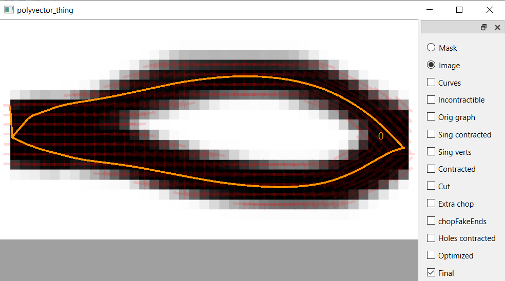
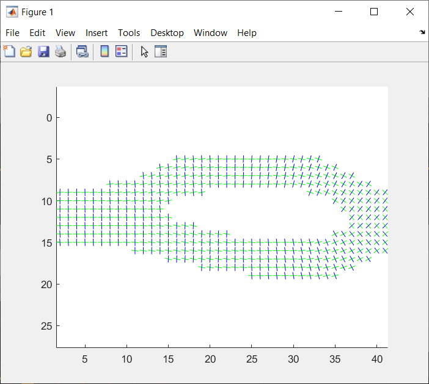

This is an implementation of "Singularity-Free Frame Fields for Line Drawing Vectorization"
by Olga Guțan*, Shreya Hegde*, Erick Jimenez Berumen, Mikhail Bessmeltsev, and Edward Chien
(Symposium on Geometry Processing 2023).

## Installation and Running
```
git clone --recursive https://github.com/SingularityFreeFrameFields/Code.git
```
then `cd` into the folder you installed the repository in, and run `finalScript_v.m`. 

## Output
### Vectorization
Running `finalScript_v.m` will produce and save an svg file with the vectorization, using our singularity-free frame-fields as
a drop-in replacement for the frame fields used originally by [[Bessmeltsev and Solomon 2019]](https://dl.acm.org/doi/10.1145/3202661), 
while maintaining the rest of their [pipeline](https://github.com/bmpix/PolyVectorization).



### Frame Fields 
It will also produce a figure of the singularity-free frame field.

 

### Example
For a raster input called `image.png`, located in `/my_inputs/`, running `finalScript_v.m` will produce `image.png.svg` in the same folder.
Subsequent re-runs overwrite past vectorizations.

## Dependencies
This code uses the [Image Graphs library](https://www.mathworks.com/matlabcentral/fileexchange/53614-image-graphs).
It also uses the [Matlab Optimization Toolbox](https://www.mathworks.com/products/optimization.html) and 
the Matlab [Image Processing Toolbox](https://www.mathworks.com/products/image.html). 

For the C++ optimization, we use the IPOPT libary, which comes pre-installed as a binary. This set-up is supported on Windows machines. 

## Parameters 
All tunable parameters, such as the weights for the smoothness and alignment terms in the optimizations, are in finalScript_v. See Sec. 5.3
of the paper for a more thorough discussion.

## Citation
If this code contributes to academic work, please cite:
```
@article {10.1111:cgf.14901,
journal = {Computer Graphics Forum},
title = {{Singularity-Free Frame Fields for Line Drawing Vectorization}},
author = {Guțan, Olga and Hegde, Shreya and Berumen, Erick Jimenez and Bessmeltsev, Mikhail and Chien, Edward},
year = {2023},
publisher = {The Eurographics Association and John Wiley & Sons Ltd.},
ISSN = {1467-8659},
DOI = {10.1111/cgf.14901}
}
```